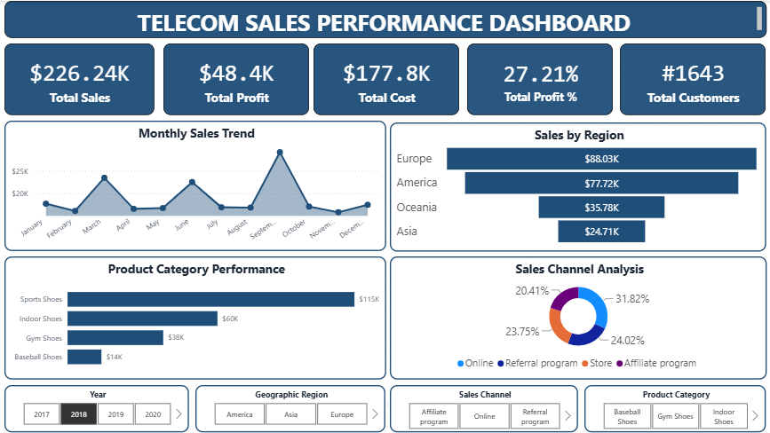
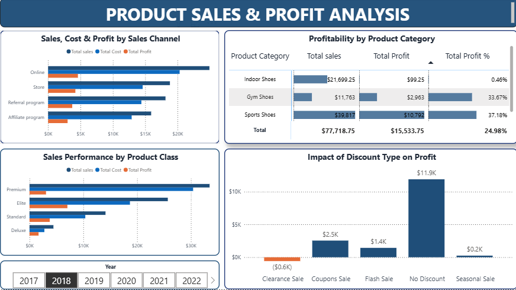

# Telecom Sales Analysis Dashboard | Power BI
Interactive Power BI dashboard for analyzing sales performance and generating business insights.

## Project Overview

The Telecom Sales Analysis Dashboard is an interactive business intelligence solution developed using Microsoft Power BI. This project analyzes telecom sales data to uncover key business insights related to sales performance, customer behavior, and profitability.

The dashboard enables business stakeholders to monitor KPIs, identify high-performing products and sales channels, understand customer trends, and make data-driven decisions.

---

# Dashboard Preview

##  Telecom Sales Analysis Dashboard

  

---

##  Sales & Profit Analysis Dashboard

  

---

## Business Objectives

* Analyze overall telecom sales performance.
* Identify top-performing products and sales channels.
* Understand customer purchasing behavior.
* Evaluate profitability across different categories.
* Assess the impact of discount strategies on business profit.

---

## Dashboard Pages

### Sales Analysis Dashboard

Key visualizations include:

* Total Sales KPI
* Total Orders KPI
* Sales Trend Analysis
* Sales by Product Category
* Sales by Sales Channel
* Geographic Sales Distribution
* Top Performing Products

### Customer Analysis Dashboard

Key visualizations include:

* Total Customers KPI
* Customer Segmentation
* Customer Distribution Analysis
* Customer Purchase Trends
* Top Customers Analysis

### Sales & Profit Analysis Dashboard

Key visualizations include:

* Total Profit KPI
* Profit Margin KPI
* Profitability by Product Category
* Sales, Cost, and Profit by Channel
* Profit by Product Class
* Impact of Discount Type on Profit

---

## Tools and Technologies Used

* Microsoft Power BI Desktop
* Power Query
* DAX (Data Analysis Expressions)
* Data Modeling
* Microsoft Excel

---

## Key Business Insights

* Non-discounted sales generated the highest profit.
* Clearance sales negatively impacted profitability.
* Certain product categories contributed significantly to total revenue.
* Customer purchasing behavior varied across sales channels.
* Online sales channels generated higher sales compared to other channels.

---

## Skills Demonstrated

* Data Cleaning and Transformation
* Data Modeling
* DAX Measures and Calculations
* KPI Design
* Interactive Dashboard Development
* Business Analysis
* Data Visualization

---

## Future Enhancements

* Sales Forecasting
* Customer Churn Analysis
* Advanced Customer Segmentation
* Drill-through and Drill-down Reports

---

