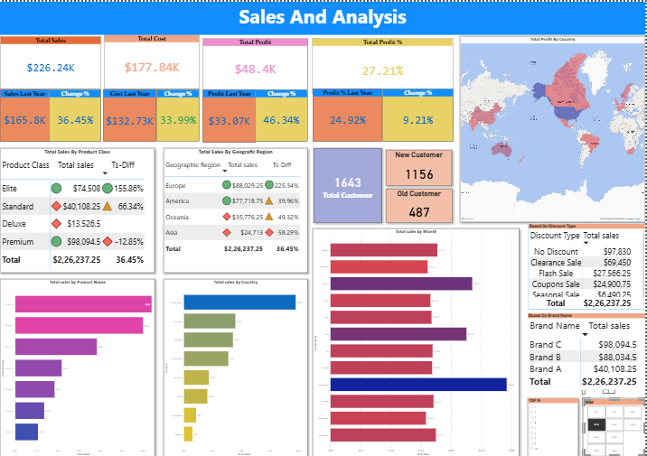
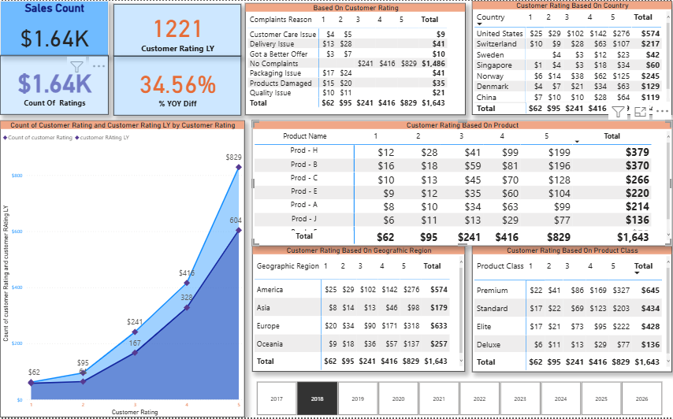
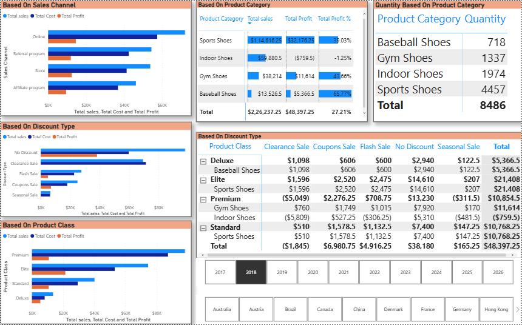

# Sales Data Analysis Dashboard (Power BI)
Interactive Power BI dashboard for analyzing sales performance and generating business insights.

## Project Overview
This project focuses on analyzing company sales data using Power BI to generate actionable insights and support data-driven decision making.

The dashboard transforms raw sales data into interactive visualizations and KPIs that help stakeholders identify trends, monitor performance, and discover business opportunities.

---

## Objectives
- Analyze sales performance across regions, products, and time periods
- Identify trends and patterns in sales data
- Provide interactive dashboards for stakeholders
- Track key metrics such as revenue, profit, and sales growth
- Improve reporting efficiency through visual analytics

---

## Tools & Technologies
- Power BI
- Power Query (ETL)
- DAX
- SQL
- Data Modeling
- Data Visualization

---

## Key Features
- Data cleaning and transformation using Power Query
- Star Schema data model for optimized performance
- KPI calculations using DAX
- Interactive multi-page dashboard
- Geographic sales analysis using maps
- Published report using Power BI Service

---

## Dashboard Visuals:-

<h2 align="center">Dashboard Preview</h2>

  

  

<h2 align="center" >**************************************************************************************</h2>

   

<h2 align="center">**************************************************************************************</h2>
 

  
  

---

## Skills Demonstrated
- Business Intelligence
- Data Analytics
- Data Modeling
- Data Visualization
- Dashboard Development
